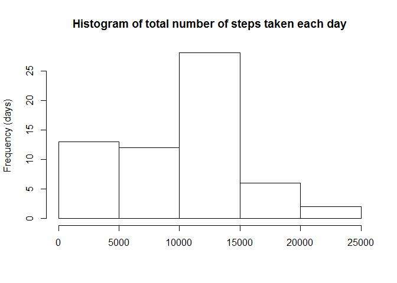
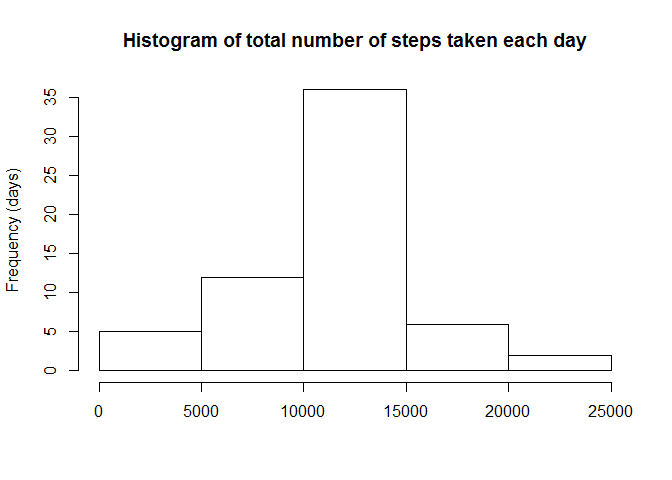
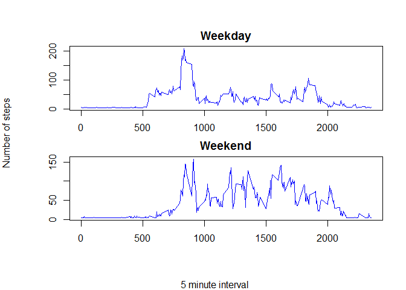

# Reproducible Research_CourseProject1
Temi A. Sorungbe  
May 11, 2016  
Set working directory and libraries

```r
file <- file.path("C:/Users/datacent52/Documents/Temilade Adelore_Office", "DataScienceCourse","ReproducibleResearch","RepData_PeerAssessment1")
setwd(file)

library(lubridate)
library(plyr)
```

```
## 
## Attaching package: 'plyr'
```

```
## The following object is masked from 'package:lubridate':
## 
##     here
```

Loading and preprocessing the data

```r
data <- read.csv(file = "activity.csv")
data$date <- ymd(data$date)

str(data)
```

```
## 'data.frame':	17568 obs. of  3 variables:
##  $ steps   : int  NA NA NA NA NA NA NA NA NA NA ...
##  $ date    : POSIXct, format: "2012-10-01" "2012-10-01" ...
##  $ interval: int  0 5 10 15 20 25 30 35 40 45 ...
```

Q1: What is the mean total number of steps taken per day? 

```r
#total number of steps taken per day
tstep_pday <- tapply(data$step, as.factor(data$date), sum, na.rm = T)

#histogram of the total number of steps taken per day
hist(tstep_pday, freq= T, main = "Histogram of total number of steps taken each day", 
     xlab="Total steps taken each day", ylab = "Frequency (days)")
```

<!-- -->

```r
#mean and median of the total number of steps per day
r <- as.list(summary(tstep_pday))
mstep_pday <- r$Mean
medstep_pday <- r$Median
```

Q2: What is the average daily activity pattern?

```r
#average number of steps taken acroos all days 
avg_da <- tapply(data$steps, as.factor(data$interval), mean, na.rm = T)

#time series plot
plot(x=rownames(avg_da), y=avg_da, type="l", col="blue", main = "Average daily activity pattern", 
     xlab = "5 minute interval", ylab = "Average number of steps") 
```

<!-- -->

```r
#5min interval with maximum number of steps
names(which.max(avg_da))      
```

```
## [1] "835"
```

Q3: Imputing missing values

```r
#total number of missing values in the data
sum(is.na(data))
```

```
## [1] 2304
```

```r
#fill all missing values with mean of average daily activity
data$steps[is.na(data$steps) == T] <- round(mean(avg_da, na.rm = T))

#histogram of total number of steps taken each day
t2step_pday <- tapply(data$step, as.factor(data$date), sum, na.rm = T)

hist(t2step_pday, freq= T, main = "Histogram of total number of steps taken each day", 
     xlab="Total steps taken each day", ylab = "Frequency (days)")
```

<!-- -->

```r
#mean and median of the total number of steps per day
r2 <- as.list(summary(t2step_pday))
m2step_pday <- r2$Mean
med2step_pday <- r2$Median

#calculate changes in total number of steps after imputing missing values
dx = NULL
dx$mvalue <-c(0 ,diff(c(r$Mean, r2$Mean)))
dx$medvalue <- c(0 ,diff(c(r$Median, r2$Median)))
        
#label the impact on mean and median total number of steps per day
#before and after imputing missing values
dx$mlabel[dx$mvalue > 0] <- "red"
dx$mlabel[dx$mvalue < 0] <- "blue"
dx$mlabel[dx$mvalue == 0] <- "grey80"

dx$medlabel[dx$medvalue > 0] <- "red"
dx$medlabel[dx$medvalue < 0] <- "blue"
dx$medlabel[dx$medvalue == 0] <- "grey80"

#values differ from Q1 mean and median estimates 
par(mfrow=c(2,1), mar = c(2,2,4,8), xpd = T)

barplot(height = c(r$Mean,r2$Mean), col = dx$mlabel,  names.arg = c("Before", "After"),
        main = "Before and After imputing missing values \n\n Mean total number of steps per day")

legend("topright", fill=c("blue", "grey", "red"), legend=c("Decrease", "No Change", "Increase"), inset = c(-0.25,0), bty="n")

barplot(height = c(r$Median,r2$Median), col= dx$medlabel, names.arg = c("Before", "After"), 
       main = "Median total number of steps per day")
```

<!-- -->

```r
dev.off()
```

```
## null device 
##           1
```

Q4. Create a new factor variable in the dataset with 2 levels "weekday" and "weekend"

```r
fwkday <- mapvalues(weekdays(data$date), from = c("Monday", "Tuesday", "Wednesday", "Thursday", "Friday", "Saturday", "Sunday"), to = c("Weekday", "Weekday", "Weekday", "Weekday", "Weekday", "Weekend", "Weekend"))

data$label <- factor(fwkday, labels = c("Weekday", "Weekend"))

#time series plot
avg_wkday = NULL
avg_wkday<- tapply(data$step[data$label=="Weekday"], data$interval[data$label=="Weekday"], mean, na.rm = T)

avg_wkend = NULL
avg_wkend <- tapply(data$step[data$label=="Weekend"], data$interval[data$label=="Weekend"],                      mean, na.rm = T)

par(mfrow=c(2,1), mar = c(2,2,2,0), oma = c(4,4,2,2))

plot(unique(data$interval),avg_wkday, type = "l", col = "blue")

title(main = "Weekday")

plot(unique(data$interval), avg_wkend, type ="l", col = "blue")

title (main = "Weekend")

title(xlab = "Interval", ylab = "Number of steps", outer = T)
```

<!-- -->

```r
dev.off()
```

```
## null device 
##           1
```
